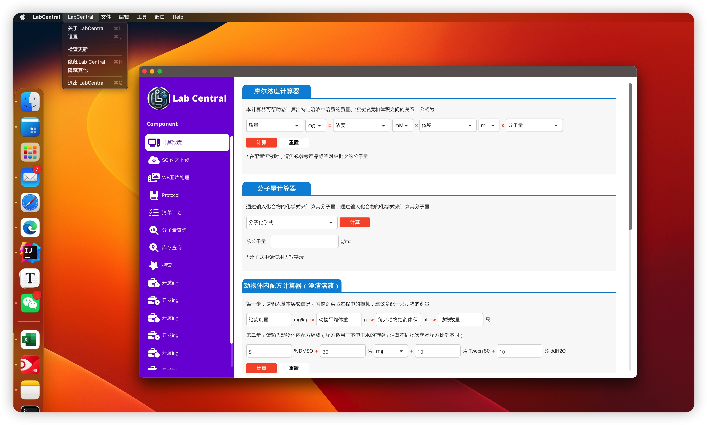
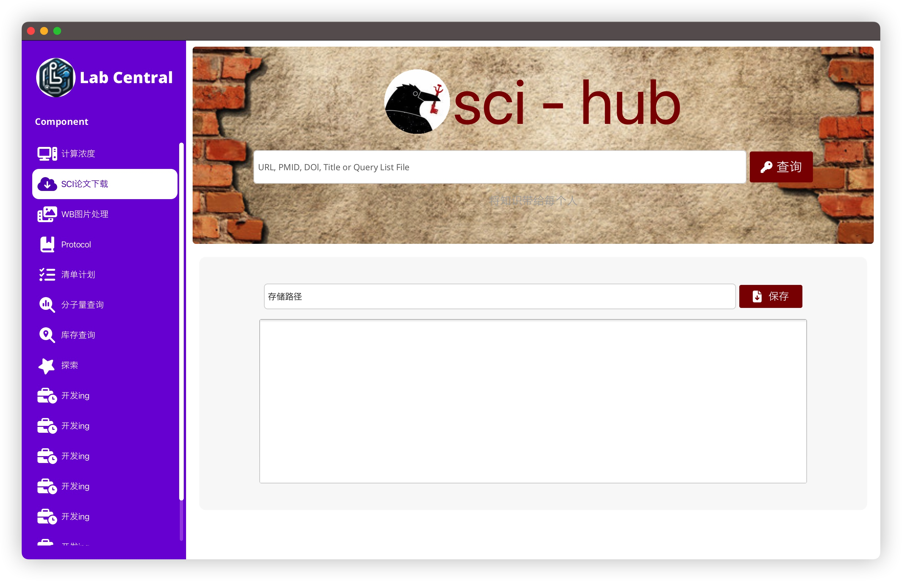
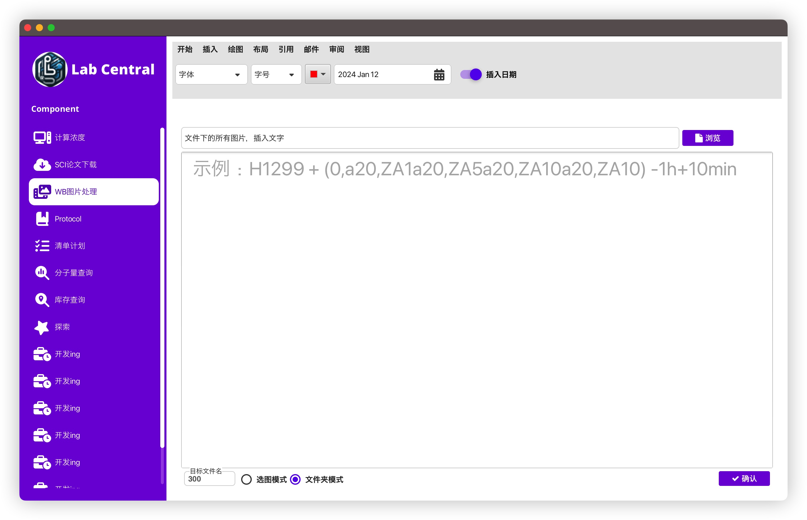
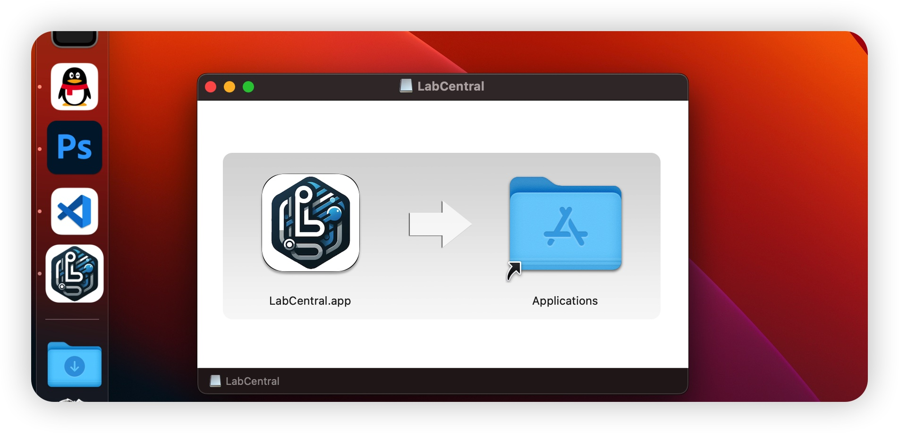
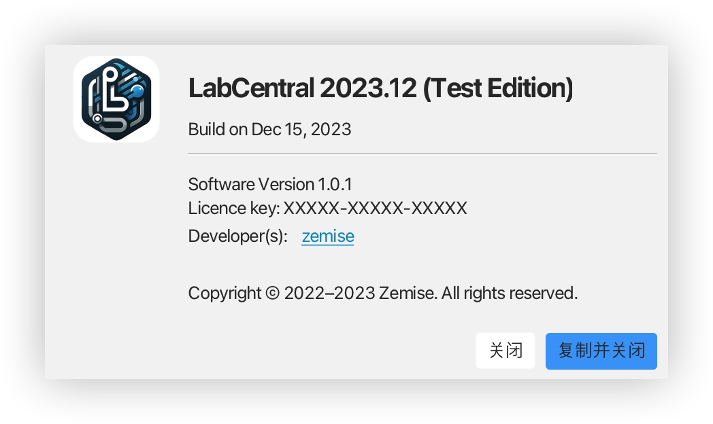

# Lab Central

# References
- SpringBoot
- JavaFX
- springboot-javafx-support
- MaterialFX
- maven-jpackage-template

# Introduction

1. I'm a medical student, not major programmer
2. I just want to build a little software for myself and practice coding

# Goals

1. Build nice, small cross-platform JavaFX desktop app.

## Requirements

- Java 18 or latest.
    - Use an SDK that has JavaFX bundled:
        - [Liberica with JavaFX](https://bell-sw.com/pages/downloads/#/java-17-current)
        - [Azul Zulu with JavaFX](https://www.azul.com/downloads/?version=java-17-sts&package=jdk-fx)

## Run
```bash
mvn javafx:run
# or
mvn spring-boot:run
```

## Package
```bash
mvn clean install
```


## some interface:

### SplashView


### CalculatorView


### SciView


### TextToImageView


### InstallView


### AboutView


### UpdateView


## ToDo
1. about packing and delivering
-[x] use maven to package dmg
-[x] use maven to package msi or exe
-[ ] add pdf viewer
-[ ] implement all functions